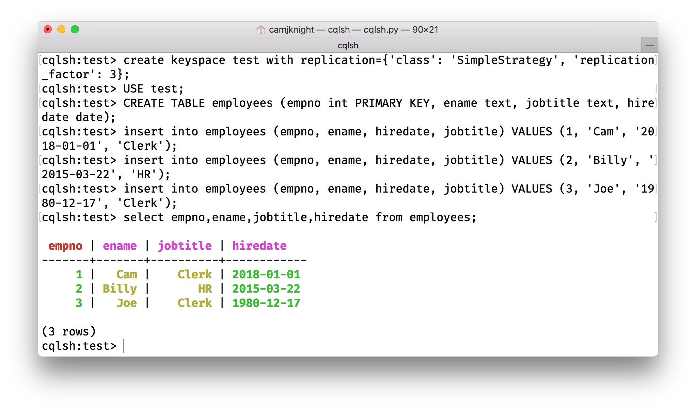
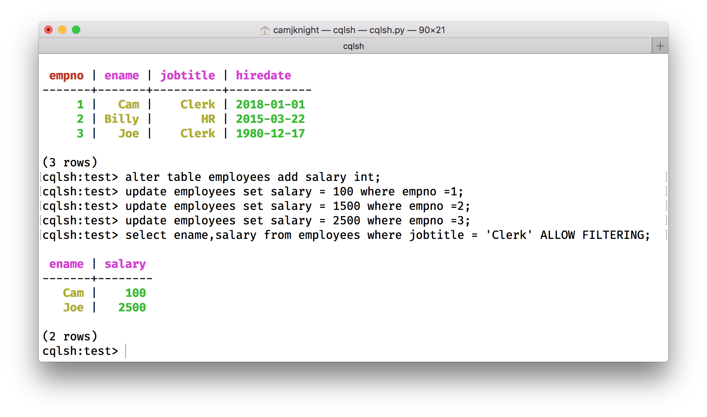
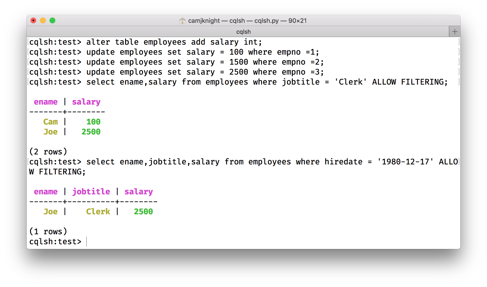
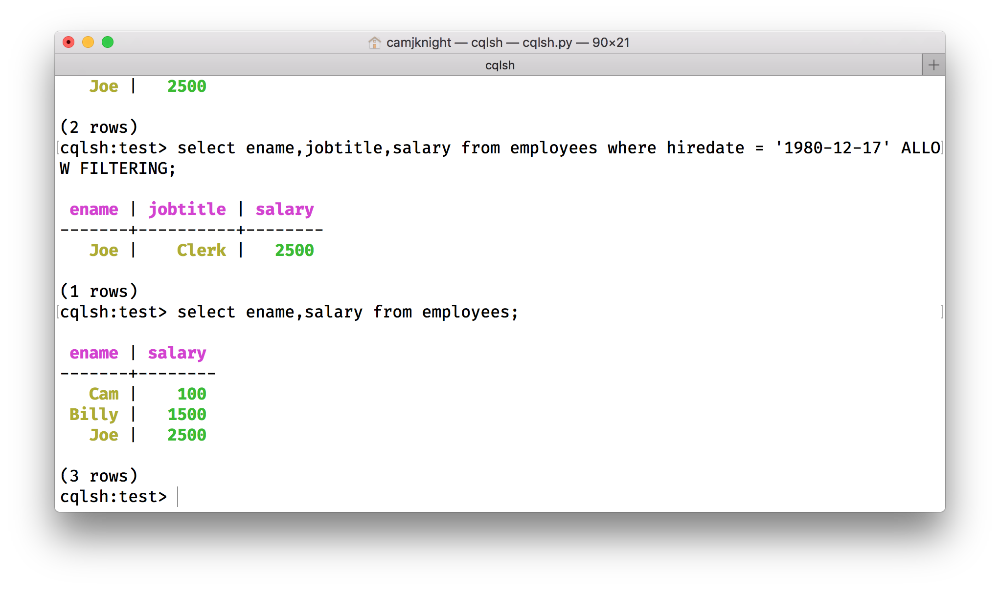
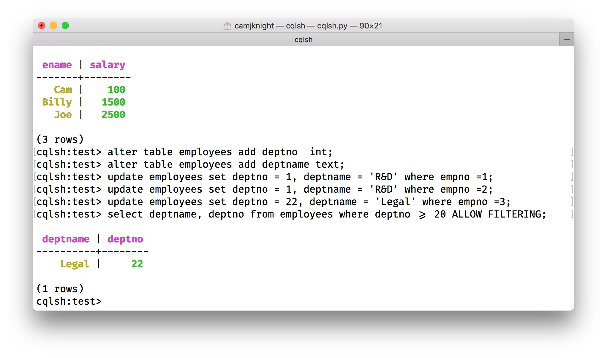
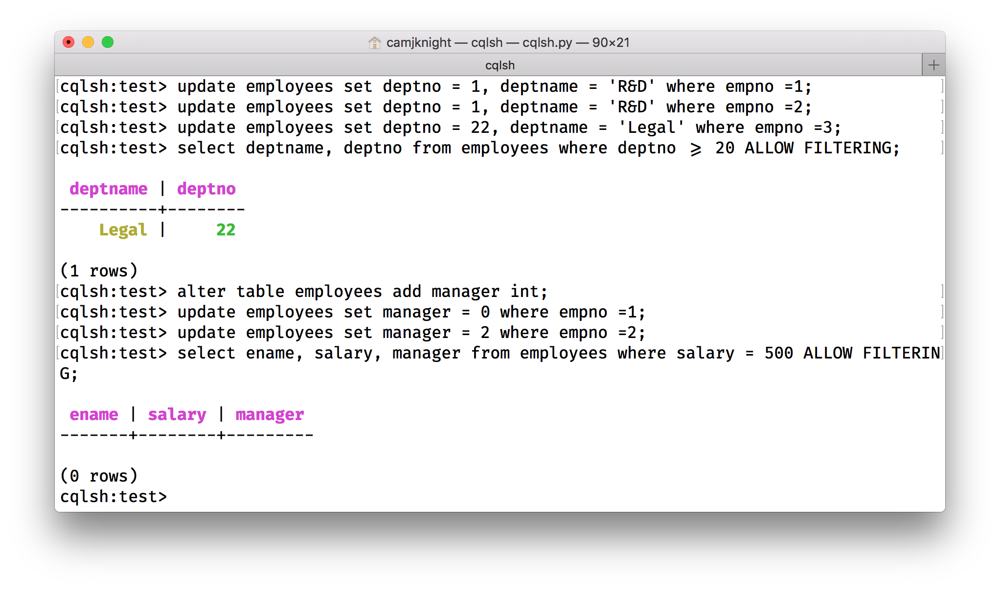

# In Class Exercise

Write a document and include your CQL screen shots for the commands below. Use the datasets provided to you in class and create a KEYSPACE with the name “test” or use appropriate KEYSPACE according to your choice. You have the flexibility to change data according to your requirements.

```sql
create keyspace test with replication={'class': 'SimpleStrategy', 'replication_factor': 3};
USE test;
```


1. List the empno,ename,jobtitle,and hiredate of employee from the employee table.

	```sql
	CREATE TABLE employees (
		empno int PRIMARY KEY, ename text, jobtitle text, hiredate date);
	insert into employees (empno, ename, hiredate, jobtitle) VALUES (1, 'Cam', '2018-01-01', 'Clerk');
	insert into employees (empno, ename, hiredate, jobtitle) VALUES (2, 'Billy', '2015-03-22', 'HR');
	insert into employees (empno, ename, hiredate, jobtitle) VALUES (3, 'Joe', '1980-12-17', 'Clerk');
	select empno,ename,jobtitle,hiredate from employees;
	```

	| empno | ename | jobtitle | hiredate   |
	|------:|------:|---------:|-----------:|
	|     1 |   Cam |    Clerk | 2018-01-01 |
	|     2 | Billy |       HR | 2015-03-22 |
	|     3 |   Joe |    Clerk | 1980-12-17 |

	


2. List the name,salary of the employees who are clerks.

	```sql
	alter table employees add salary int;
	update employees set salary = 100 where empno =1;
	update employees set salary = 1500 where empno =2;
	update employees set salary = 2500 where empno =3;
	select ename,salary from employees where jobtitle = 'Clerk' ALLOW FILTERING;
	```

	| ename | salary |
	|------:|-------:|
	|   Cam |    100 |
	|   Joe |   2500 |

	


3. List the name,job,salary of every employee joined on ‘december 17,1980’,

	```sql
	select ename,jobtitle,salary from employees where hiredate = '1980-12-17' ALLOW FILTERING;
	```

	| ename | jobtitle | salary |
	|------:|---------:|-------:|
	|   Joe |    Clerk |   2500 |

	


4. List name and annual salary of all the employees.

	```sql
	select ename,salary from employees;
	```

	| ename | salary |
	|------:|-------:|
	|   Cam |    100 |
	| Billy |   1500 |
	|   Joe |   2500 |

	


5. List the department name & deptno for departments having deptno.>=20

	```sql
	alter table employees add deptno  int;
	alter table employees add deptname text;
	update employees set deptno = 1, deptname = 'R&D' where empno =1;
	update employees set deptno = 1, deptname = 'R&D' where empno =2;
	update employees set deptno = 22, deptname = 'Legal' where empno =3;
	select deptname, deptno from employees where deptno >= 20 ALLOW FILTERING;
	```

	| deptname | deptno |
	|---------:|-------:|
	|    Legal |     22 |

	


6. Display employees’ names, salary and manager values of those employees whose salary is 500 from EMP table using SELECT statement.

	```sql
	alter table employees add manager int;
	update employees set manager = 0 where empno =1;
	update employees set manager = 2 where empno =2;
	select ename, salary, manager from employees where salary = 500 ALLOW FILTERING;
	```

	| ename | salary | manager |
	|------:|-------:|--------:|

	


7. Write a query that displays enames with first letter capitalized and all other letters in lowercase and length of enames whose enames start with J, A or N.
