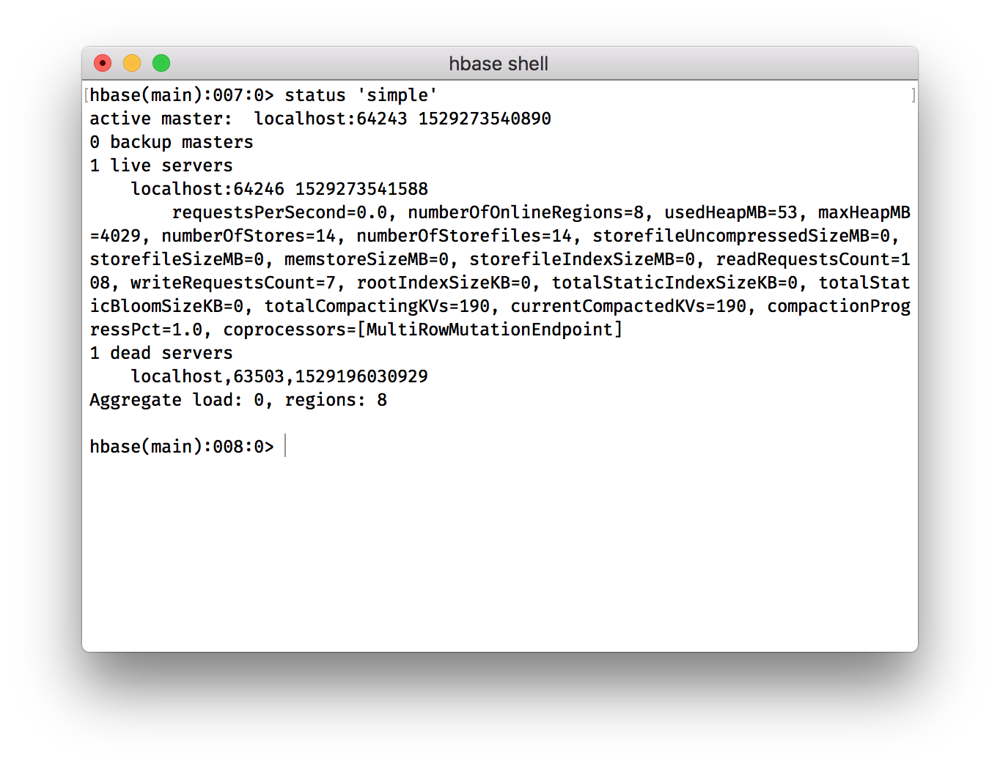
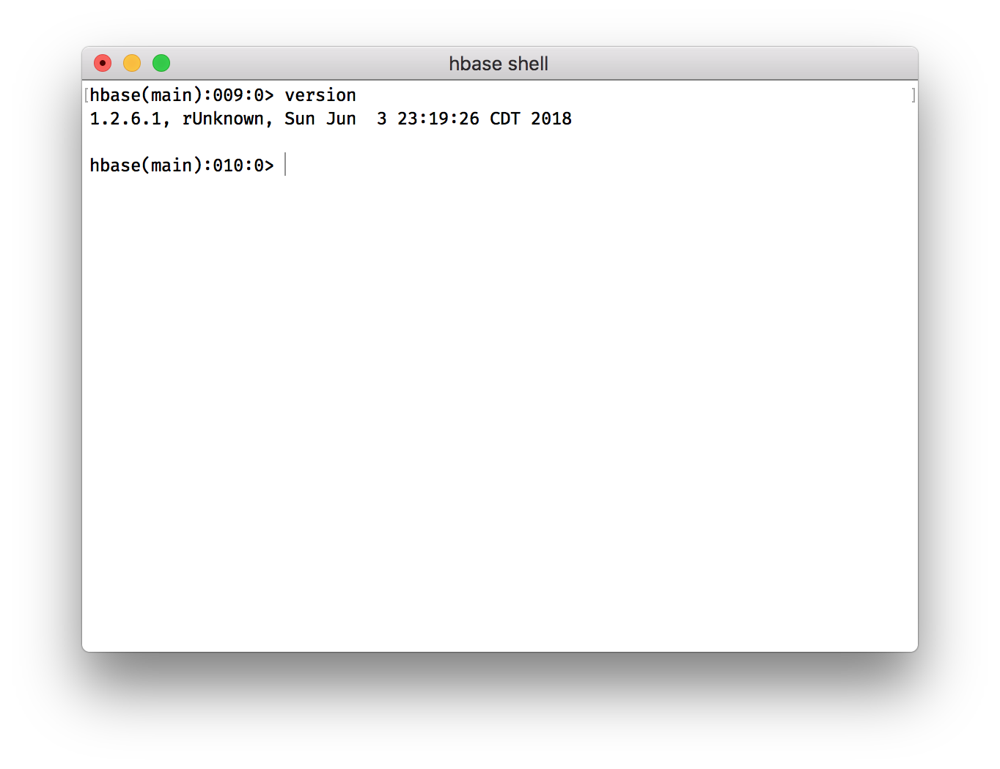
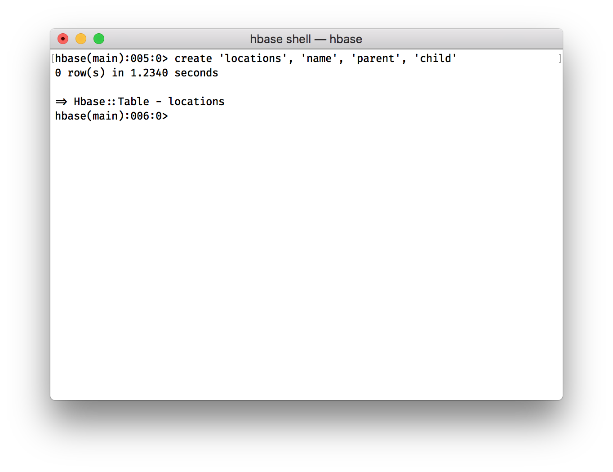
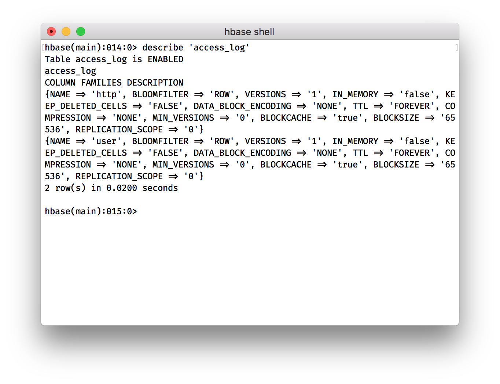
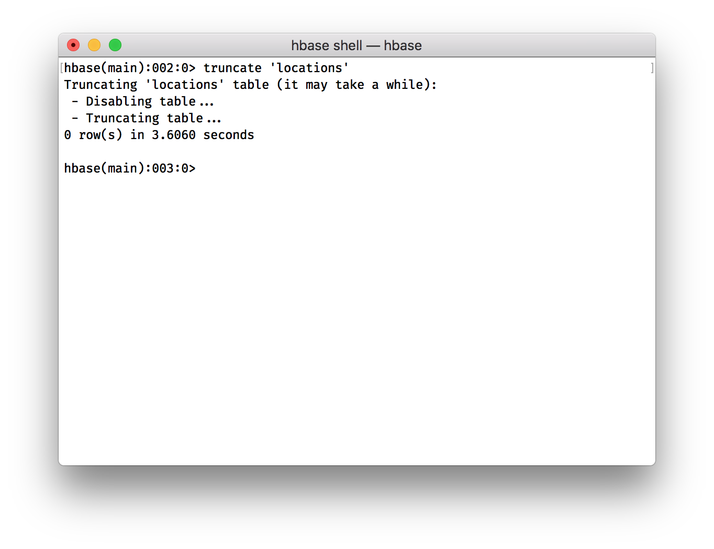
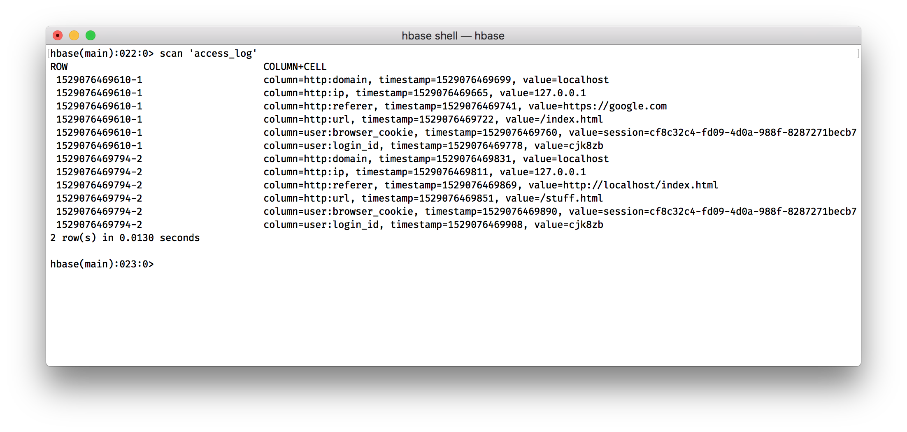
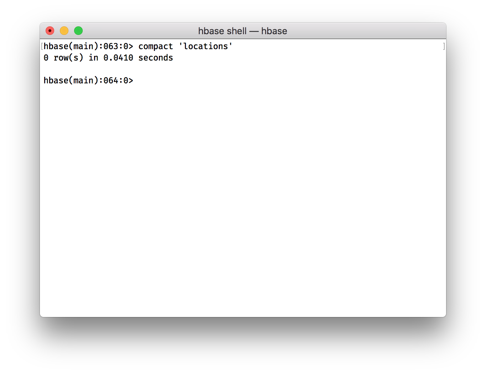

# HBase
## Hadoop Dependent Column based No SQL Tool - HBase
Introduction of HBase, A Column Based No SQL Tool.

## In Class Exercise:
1. **Table Creation:** Create Table for the all the 5 use-cases, please refer to lecture slides for detailed column description
	- **Use Case 1:** Locations

		```ruby
		create 'locations', 'name', 'parent', 'child'

		put 'locations', '1', 'name', 'China'
		put 'locations', '1', 'child:2', 'State'
		put 'locations', '1', 'child:3', 'State'
		put 'locations', '1', 'child:4', 'State'
		put 'locations', '1', 'child:5', 'State'
		put 'locations', '1', 'child:6', 'City'
		put 'locations', '1', 'child:7', 'City'
		put 'locations', '1', 'child:8', 'State'
		put 'locations', '1', 'child:8', 'City'

		put 'locations', '2', 'name', 'Beijing'
		put 'locations', '2', 'parent:1', 'Nation'

		put 'locations', '3', 'name', 'Shanghai'
		put 'locations', '3', 'parent:1', 'Nation'

		put 'locations', '4', 'name', 'Guangzhou'
		put 'locations', '4', 'parent:1', 'Nation'

		put 'locations', '5', 'name', 'Shandong'
		put 'locations', '5', 'parent:1', 'Nation'
		put 'locations', '5', 'child:6', 'City'
		put 'locations', '5', 'child:7', 'City'

		put 'locations', '6', 'name', 'Jinan'
		put 'locations', '6', 'parent:1', 'Nation'
		put 'locations', '6', 'parent:5', 'State'

		put 'locations', '7', 'name', 'Qingdao'
		put 'locations', '7', 'parent:1', 'Nation'
		put 'locations', '7', 'parent:5', 'State'

		put 'locations', '8', 'name', 'Sichuan'
		put 'locations', '8', 'parent:1', 'Nation'
		put 'locations', '8', 'child:9', 'City'

		put 'locations', '9', 'name', 'Chengdu'
		put 'locations', '9', 'parent:1', 'Nation'
		put 'locations', '9', 'parent:8', 'State'
		```

	- **Use Case 2:** Student Courses
	
		```ruby
		create 'students', 'info', 'course'
		create 'courses', 'info', 'student'
			
		put 'students', '16095453', 'info:name', 'Cameron Knight'
		put 'students', '16095453', 'info:sex', 'M'
		put 'students', '16095453', 'info:age', '35'
		put 'students', '16095453', 'course:CSEE5590/490', 'Combined'
		
		put 'students', '22222222', 'info:name', 'Nurkobil Urmanov'
		put 'students', '22222222', 'info:sex', 'M'
		put 'students', '22222222', 'info:age', '103'
		put 'students', '22222222', 'course:CSEE5590/490', 'Combined'
		
		put 'courses', 'CSEE5590/490', 'info:title', 'Big Data Programming'
		put 'courses', 'CSEE5590/490', 'info:introduction', 'Programming with Hadoop/Eco-Systems and Spark.'
		put 'courses', 'CSEE5590/490', 'info:teacher_id', '11111111'
		put 'courses', 'CSEE5590/490', 'student:16095453', 'Graduate'
		put 'courses', 'CSEE5590/490', 'student:22222222', 'Undergraduate'
		```
		
	- **Use Case 3:** User - Action
	
		```ruby
		create 'user_actions', 'name'
		# Row Key: [user]-[reverse_timestamp]-[event_id]
		
		class UserAction
		  def initialize(user)
		    @user = user
		  end
		  
		  def event(event_id)
		    reverse_timestamp = JavaLang::Long::MAX_VALUE - JavaLang::System.currentTimeMillis()
		    "#{@user}-#{reverse_timestamp}-#{event_id}"
		  end
		end
		
		user_action = UserAction.new('cjk8zb')
		
		put 'user_actions', user_action.event(5401), 'name', 'LOGIN FAILURE'
		put 'user_actions', user_action.event(1003), 'name', 'RESET PASSWORD'
		put 'user_actions', user_action.event(1001), 'name', 'LOGIN'
		put 'user_actions', user_action.event(2001), 'name', 'CHECK MESSAGES'
		put 'user_actions', user_action.event(2005), 'name', 'SEND MESSAGE'
		put 'user_actions', user_action.event(1002), 'name', 'LOGOUT'		```
	
	- **Use Case 4:** User - Friends
	
		```ruby
		create 'user_friends', 'info', 'friend'
		put 'user_friends', 'cjk8zb', 'info:name', 'Cameron'
		put 'user_friends', 'cjk8zb', 'info:sex', 'Male'
		put 'user_friends', 'cjk8zb', 'info:age', '35'
		put 'user_friends', 'cjk8zb', 'friend:nuz7b', 'Teammate'
		```
	
	- **Use Case 5:** Access Log

		```ruby
		create 'access_log', 'http', 'user'

		class AccessLog
		  @@inc_counter = 0
		  def self.key
		    "#{JavaLang::System.currentTimeMillis()}-#{@@inc_counter += 1}"
		  end
		end
		
		access_log_key = AccessLog.key
		put 'access_log', access_log_key, 'http:ip', '127.0.0.1'
		put 'access_log', access_log_key, 'http:domain', 'localhost'
		put 'access_log', access_log_key, 'http:url', '/index.html'
		put 'access_log', access_log_key, 'http:referer', 'https://google.com'
		put 'access_log', access_log_key, 'user:browser_cookie', 'session=cf8c32c4-fd09-4d0a-988f-8287271becb7'
		put 'access_log', access_log_key, 'user:login_id', 'cjk8zb'
		access_log_key = AccessLog.key
		put 'access_log', access_log_key, 'http:ip', '127.0.0.1'
		put 'access_log', access_log_key, 'http:domain', 'localhost'
		put 'access_log', access_log_key, 'http:url', '/stuff.html'
		put 'access_log', access_log_key, 'http:referer', 'http://localhost/index.html'
		put 'access_log', access_log_key, 'user:browser_cookie', 'session=cf8c32c4-fd09-4d0a-988f-8287271becb7'
		put 'access_log', access_log_key, 'user:login_id', 'cjk8zb'		```

2. Choose any 2 Use Cases from given 5 use case. For each use-case, construct 2 queries on each type of HBase Command (total of 8 queries)

	- General HBase shell commands
	
		```ruby
		status 'simple'
		```
		
		
		
		```ruby
		version
		```
		
		
		
	- Tables Management commands
	
		```ruby
		create 'locations', 'name', 'parent', 'child'
		```
		
		
		
		```ruby
		describe 'access_log'
		```
	
		
		
	- Data Manipulation commands
	
		```ruby
		truncate 'locations'
		```
		
		

		```ruby
		scan 'access_log'
		```

			
	- HBase surgery tools

		```ruby
		compact 'locations'
		```

		

		```ruby
		flush 'access_log'
		```
		
		
